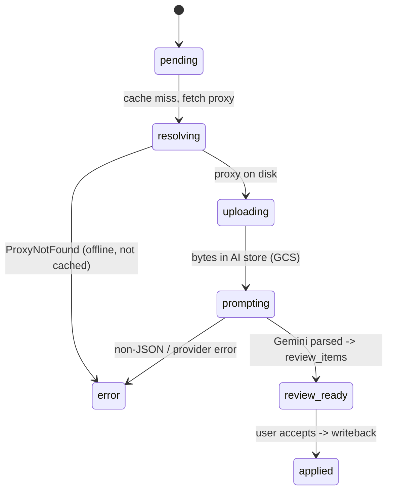

# Feasibility study: Restate for process visualization & exploration

**Date:** 2026-06-23
**Status:** Complete — **recommendation: do NOT adopt Restate for this goal**
**Author:** Claude Code session (`claude/restate-workflow-visualization-f8apb0`)
**Subject:** [restatedev/restate](https://github.com/restatedev/restate) — durable-execution engine

---

## TL;DR

The stated goal is **comprehension**: let humans and AI agents quickly answer
"how does annotation of an uncached clip work?" and "how does writeback to the
archive work?" by *exploring a visual model of our processes*.

Restate is a **durable-execution runtime**. Its UI is a live *invocation
debugger* for workflows **as they run on the Restate server** — not a generator
of static, explanatory documentation of how our code is structured. To get even
that runtime view, we would have to **rewrite `annotator.py` and `sync_engine.py`
as Restate handlers running on a separate Rust server process**.

That is a large, partly irreversible migration whose payoff (a live invocation
timeline) **does not answer the question being asked** and **conflicts with this
app's hard offline-first constraint**. It is the wrong tool for this goal.

The goal is already 80% solved by a pattern this repo *already uses*:
**Mermaid process diagrams** (`docs/onboarding/` has flowcharts,
`stateDiagram-v2`, and `sequenceDiagram` blocks today) backed by state-machine
enums that already live in the code. The cheap, high-fit path is to **extend
that into a generated, AI-navigable "process catalog"** — not to adopt a runtime.

**Verdict: Not recommended.** A cheaper alternative that actually meets the goal
is proposed in §7. Restate becomes worth a second look only under the triggers in §8.

---

## 1. The ask (restated)

> "Visually document processes in the application by using the workflow code and
> use a visualization tool to explore — by AI agents and humans too. E.g. quickly
> answer: how does annotation of an uncached clip work; how does writeback to
> archive work."

Decompose this into the actual requirements:

- **R1 — Comprehension, not execution.** The output is an *explanation* of how a
  process works, readable cold by someone (or some agent) who didn't write it.
- **R2 — Source-of-truth fidelity.** The visual must reflect the *real* code, and
  not drift from it, or it is worse than nothing.
- **R3 — Dual audience.** Both humans (a diagram) and AI agents (structured,
  greppable text) must be able to consume it.
- **R4 — Low marginal cost per process.** "Quickly answer" implies we can cover
  many flows cheaply, not hand-build a bespoke artifact each time.
- **R5 — Must respect offline-first.** Per `CLAUDE.md`, the entire app must stay
  navigable fully offline; nothing in the comprehension layer can assume an
  always-on external runtime.

Note what is **not** in the ask: durability, exactly-once semantics, distributed
retries, saga orchestration. Those are Restate's actual product.

---

## 2. What Restate actually is

From the project README and the Restate UI announcement:

- A **durable-execution platform**: you write handlers/workflows in an SDK
  (TypeScript, Java/Kotlin, Python, Go, Rust) using async/await, and a **Restate
  server** (a Rust binary you run via Docker/npx/Homebrew) journals every step so
  code resumes after failure with exactly-once effects.
- It ships **a UI and CLI to inspect invocations**: a *live timeline* of execution
  steps, retries, nested RPC calls, awakeables/promises, and a "distributed call
  stack" linking invocations across services.
- The UI answers operational questions like *"where did my workflow get stuck?"*,
  *"how many times was this retried and which step failed?"*, *"what is blocking
  this invocation?"* — by **querying actual invocations that have run**.

Two facts decide this study:

1. **The README does not claim diagram/static-documentation generation.** The
   visualization is of *running invocations*, keyed on real execution data — not
   a rendering of "how the code is structured" derived from source.
2. **The UI only sees work that runs on the Restate runtime.** It has zero
   visibility into a process until that process has been ported onto Restate
   handlers and actually invoked.

Sources:
- <https://github.com/restatedev/restate>
- <https://www.restate.dev/blog/announcing-restate-ui>
- <https://docs.restate.dev/develop/ts/workflows/>

---

## 3. The core mismatch

| Requirement | What Restate gives you | Fit |
|---|---|---|
| R1 Comprehension (static "how it works") | A **live runtime debugger** of invocations | ✗ wrong kind of artifact |
| R2 Fidelity to code | High — but **only after** the code is ported onto Restate | ✗ requires rewrite first |
| R3 Dual human + AI audience | A web UI for humans; no documentation export for agents | ◑ humans only |
| R4 Low marginal cost per flow | Each flow must be **rewritten as a Restate handler** to appear at all | ✗✗ very high cost |
| R5 Offline-first | Adds an always-on Rust server in the data path | ✗ conflicts with hard constraint |

The mismatch is categorical, not a tuning problem. Restate visualizes
**executions**; the user is asking to visualize **the design**. To answer "how
does annotation of an uncached clip work" in Restate's UI, you would have to
actually annotate an uncached clip and then read *that invocation's* journal —
which shows the steps that fired *this time*, not a teachable model of the flow,
its branches, and its failure modes.

---

## 4. Adoption cost (if we ignored the mismatch and ported anyway)

Our two named flows are **already durable, hand-rolled workflows** with explicit
state machines on SQLite. Porting them to Restate is a from-scratch rewrite of
the orchestration core, not a wrapper:

- **Annotation** (`backend/app/services/annotator.py`): `run_job()` →
  `_process_item()` walks `pending → resolving → uploading → prompting →
  review_ready` (statuses in `backend/app/models/job.py:9`), with cache-layer
  branching (proxy resolver, AI store) and finalization into `annotations` /
  `review_items`.
- **Writeback** (`backend/app/services/sync_engine.py` +
  `services/write_queue.py` + `services/publish_service.py`): a background
  `_tick()` loop drains `pending_operations` with exponential backoff, etag
  conflict detection, and `pending → in_flight → applied | conflict | failed`
  transitions, mirrored by `clip_versions` `publishing → live | conflict |
  failed | superseded`.

To put these on Restate you would: stand up and operate the Restate server,
re-express every state transition as journaled handler steps, re-wire the FastAPI
routes to submit invocations, migrate or dual-write the existing SQLite state,
and re-validate the offline-degradation matrix. This is **multi-week-to-month**
work for a small team, and the orchestration code is the riskiest code to rewrite
because its whole job is correctness under partial failure.

Crucially, **none of that cost buys R1–R4.** It buys durable execution we already
have a working (if bespoke) version of, plus a runtime debugger.

---

## 5. Offline-first conflict (a hard constraint here)

`CLAUDE.md` is emphatic that the app must remain fully navigable offline, across a
matrix of states (CatDV offline / GCS offline / both). The design deliberately
keeps orchestration in-process on SQLite so that cache misses degrade gracefully
to a clear error rather than a hang. Introducing a Restate server into the
execution path adds a new always-on dependency and a new failure mode squarely in
the orchestration core — the opposite of the architecture's stated direction
(`CLAUDE.md` "No app-wide god-context", single FastAPI process, DB-first
offline-safe services; ADR 0047).

---

## 6. Steelman: when *would* Restate make sense here?

To be fair to the technology — it is genuinely good, and there is a real
observation behind the request:

- We **have hand-rolled durable execution** (retry/backoff, attempt counters,
  atomic terminal transitions, conflict handling). That is exactly Restate's
  domain, and a future where this bespoke machinery becomes a maintenance burden
  is imaginable.
- Restate has first-class **durable AI-agent loop** support, and this project is
  moving toward AI agents.

But adopting Restate would be a decision about **our execution runtime**, justified
by durability/operability needs — **not** a decision about *documentation*. Buying
a durable-execution engine to get a process diagram is paying for a datacenter to
get a whiteboard. If we ever adopt it, do so for §8's reasons, and treat the
invocation UI as a *bonus for ops*, never as the answer to "how does this work?"

---

## 7. Recommended alternative — a generated, AI-navigable process catalog

This directly satisfies R1–R5 at a tiny fraction of the cost, and it extends a
pattern **already in the repo** rather than introducing a runtime.

**What's already true:**
- `docs/onboarding/` already contains Mermaid `flowchart`, `stateDiagram-v2`, and
  `sequenceDiagram` blocks — humans and AI agents both read these fluently.
- The state machines are already explicit, single-source `Literal` enums
  (`models/job.py`, the `pending_operations` / `clip_versions` status literals).
- The step sequence of each flow is already linear and named in the service
  functions (`_process_item`, `_tick`, `enqueue_apply`).

**The gap** is only that this is scattered and hand-maintained, so it can drift
(violating R2) and isn't organized for "pick a process, see its model" exploration.

**Proposed minimal build (days, not months):**

1. **`docs/processes/` catalog** — one Markdown file per orchestration (start with
   the two named flows + the inventory the study surfaced: restore-draft, media
   prefetch, upload GC). Each file: a one-line purpose, a `sequenceDiagram` of the
   happy path, a `stateDiagram-v2` of the status machine, the **DB tables touched**,
   the **failure/offline branches**, and **`file:line` anchors** to the real code.
2. **Drift guard** — a unit test (mirroring the existing
   `tests/unit/test_*_guard.py` pattern) that asserts the states named in each
   process doc's `stateDiagram` are exactly `get_args(<the Literal>)`. This makes
   the diagrams *fail CI when they drift from code* — closing R2, the thing
   Restate could only offer by full rewrite.
3. **AI-navigability (R3)** — keep it as plain Markdown + Mermaid under a
   predictable path so an agent can `grep`/read it; optionally expose a tiny
   read-only endpoint or MCP resource later if agents need it programmatically.
   No new runtime, no license seat, fully offline.

This is also consistent with `CLAUDE.md`'s "explore before implementing / reuse
the existing pattern" rule — the existing pattern is Mermaid docs, and we should
extend it, not parallel-evolve a second system.

**Illustrative excerpt — "annotation of an uncached clip" (the real verifiable answer to the question):**

> Fast-path note: if `ai_store.status(clip_key)` already has the clip, `resolving`
> and `uploading` are skipped entirely (`annotator.py:_process_item`). That branch
> — the thing a newcomer most needs to understand — is teachable in a diagram and
> *invisible* in a Restate invocation journal unless you happen to run both cases.

---

## 8. Decision triggers — revisit Restate only if…

Adopt a durable-execution engine for **execution** reasons, never for docs:

- The bespoke retry/conflict machinery in `sync_engine.py` becomes a recurring
  source of correctness bugs we can't contain, **and**
- We need to distribute orchestration beyond a single process (multi-worker,
  cross-host), **and**
- We are willing to relax or re-architect the strict single-process offline-first
  model, **and**
- The AI-agent roadmap needs durable, resumable long-running agent loops that our
  current job runner can't serve.

If/when several of those hold, write a fresh ADR scoped to *runtime*, and re-run a
cost/offline analysis. Until then, the invocation UI is not a reason to adopt.

---

## 9. How to validate this study's claims (acceptance flow)

A reviewer can confirm the reasoning without taking it on faith:

1. **Restate's UI is runtime-only:** read
   <https://www.restate.dev/blog/announcing-restate-ui> — confirm every screenshot
   is an *invocation* timeline, and there is no "generate docs from source" feature.
2. **Our flows are already durable state machines:** open
   `backend/app/services/annotator.py` (`_process_item`) and
   `backend/app/services/sync_engine.py` (`_tick`, `_handle_result`,
   `_retry_or_fail`) — confirm the retry/backoff/conflict logic and status
   transitions already exist.
3. **The states are already single-source enums:** open `backend/app/models/job.py`
   (`ItemStatus`) — confirm the diagram in §7 is just `get_args(ItemStatus)`.
4. **The Mermaid-doc pattern already exists:** `grep -l mermaid docs/onboarding/*.md`
   returns several files including `02-architecture.md` (6 Mermaid blocks, incl.
   `stateDiagram-v2` and `sequenceDiagram`).
5. **Offline-first is a hard constraint:** read the "Cache management" and
   "Patterns we've removed" sections of `CLAUDE.md`.

If all five hold, the conclusion follows: Restate is the wrong tool for *this*
goal, and the process-catalog alternative meets it at far lower cost and risk.
