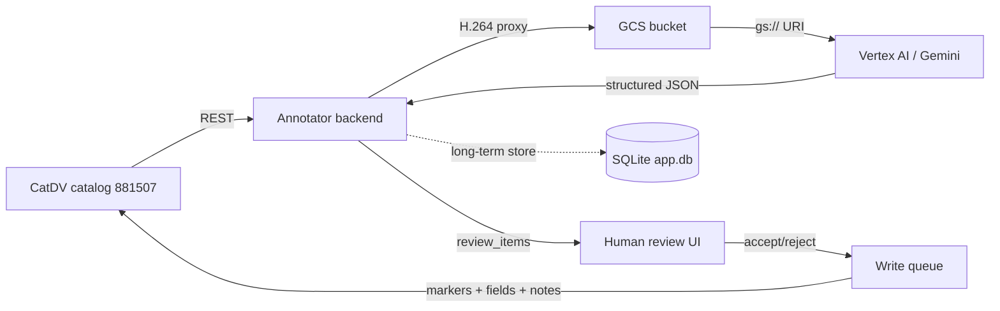

# 01 — What this app does and who it's for

## In one paragraph

The **CatDV Annotator** is a local-first web app that sits next to a
CatDV archive and adds two things CatDV itself doesn't have:
a Google **Gemini-backed AI annotation pipeline** for video clips, and a
durable **long-term annotation store** in SQLite that a future search
app can layer on top of. It reads and edits a single CatDV catalog
(*"AI katalog"*), drives Gemini batch jobs against clip
proxies, gates every result behind a human review step, then writes
the approved markers / fields / notes back to CatDV via its REST API.

## Who it's for

| Audience | Role |
|---|---|
| **The AI operator account** | One person (in the CatDV `ai` group) drives all annotation runs. Runs on a Mac in dev today; eventually on the CatDV server itself. |
| **The archive** | ~10 000 clips of 1920s–30s home-movie footage. Too large for human-only annotation, too messy for CatDV's built-in search. |
| **A future curation/search app** | Not built. The SQLite schema reserves tables (`embeddings`, `tags`) so a second project can layer semantic retrieval on top without touching CatDV. |

## What it does (end-to-end)

1. Operator browses the local clip list (mirrored from CatDV in SQLite
   for offline reading).
2. Operator picks a clip → **Annotate ▾** → pick a prompt version.
3. Backend resolves the clip's H.264 web proxy (downloaded from CatDV
   over the VPN, or read straight from disk if running on the CatDV
   host).
4. Proxy is uploaded once to GCS; Vertex AI reads the `gs://` URI and
   returns structured JSON matching the prompt's output schema.
5. The result becomes draft `review_items` (proposed markers / fields /
   notes). The user accepts or rejects each one.
6. Accepted items become `ChangeOp`s on a durable **write queue** and
   are flushed to CatDV by the sync engine when the connection is up.

## Out of scope (explicitly)

- Multi-user, sharing, real authentication.
- A dedicated search / curation app — schema reserves slots, but that's
  a separate project.
- Catalog management UI (browse only).
- Editing markers / metadata outside of the annotation review flow.
- Creating CatDV field definitions (admin-only on the server, done by
  the CatDV admin when needed).
- Desktop bundling (Electron / Tauri).

## Three runtime concerns that drove the architecture

The design spec
([`docs/specs/2026-05-18-catdv-annotator-design.md`](../specs/2026-05-18-catdv-annotator-design.md))
calls out three constraints that shape almost everything else:

1. **Slow VPN in dev (~370 KB/s).** All CatDV calls share one
   authenticated `catdv_client` session with transparent re-login; proxy
   downloads use HTTP `Range` for resumable streaming; the same code
   runs at native speed over loopback in prod.
2. **Long Gemini jobs.** Each batch is a background task; the browser
   subscribes via Server-Sent Events; closing the tab does not stop the
   job.
3. **Write-back is gated by review.** Gemini's output **never** reaches
   CatDV directly — it lands in `review_items` first.

Plus one more constraint that's not in the spec but bites every day:

4. **CatDV Enterprise has only 2 license seats.** One is held by the
   human web client, so the app effectively has one seat. Leaking a
   `JSESSIONID` locks the server out. See
   [`05-catdv-license-discipline.md`](./05-catdv-license-discipline.md)
   — read it before launching anything.
