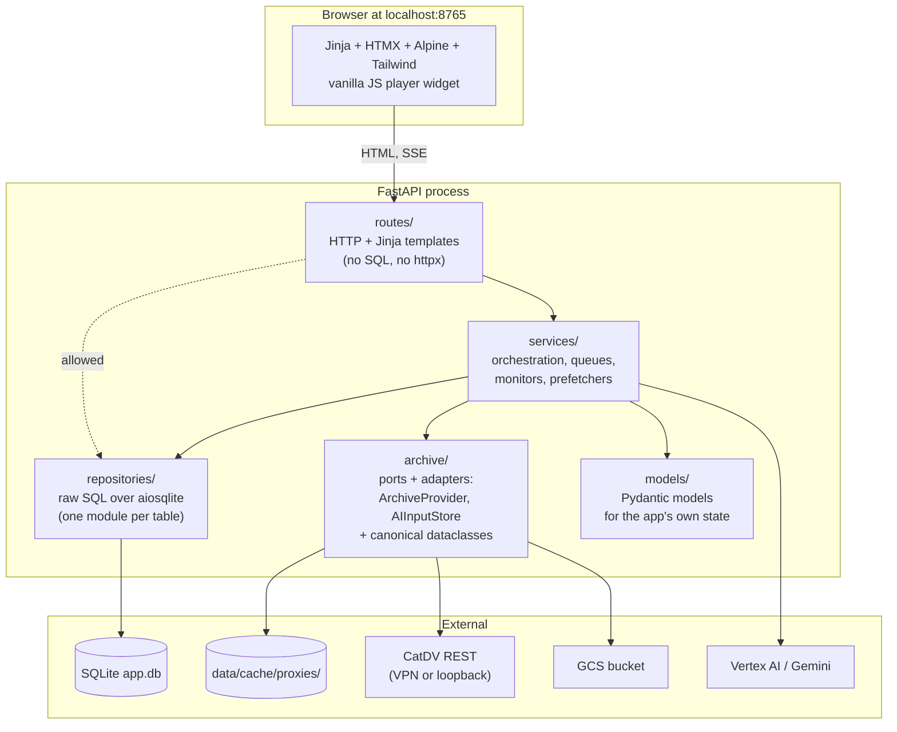
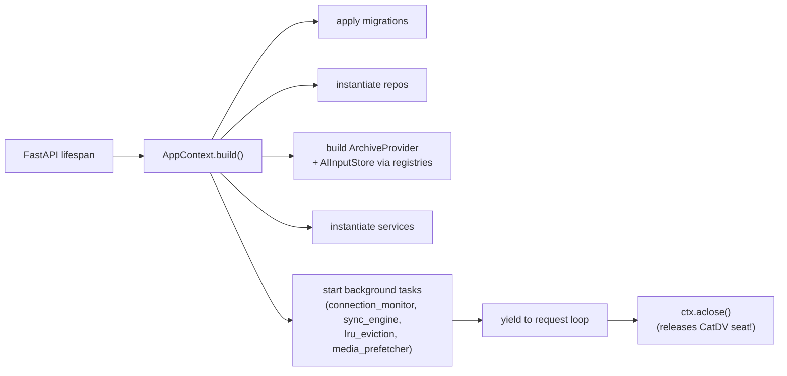
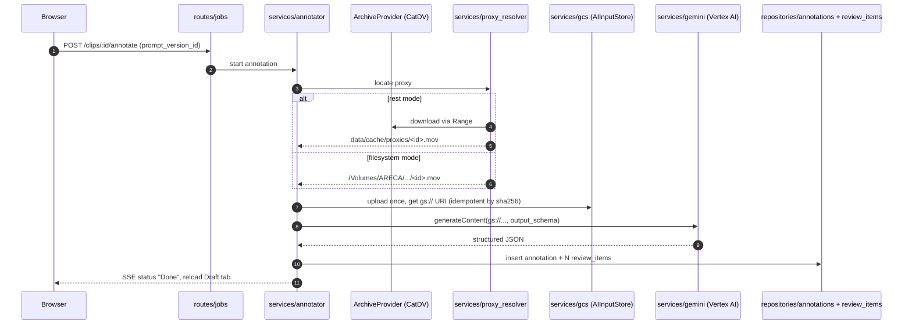
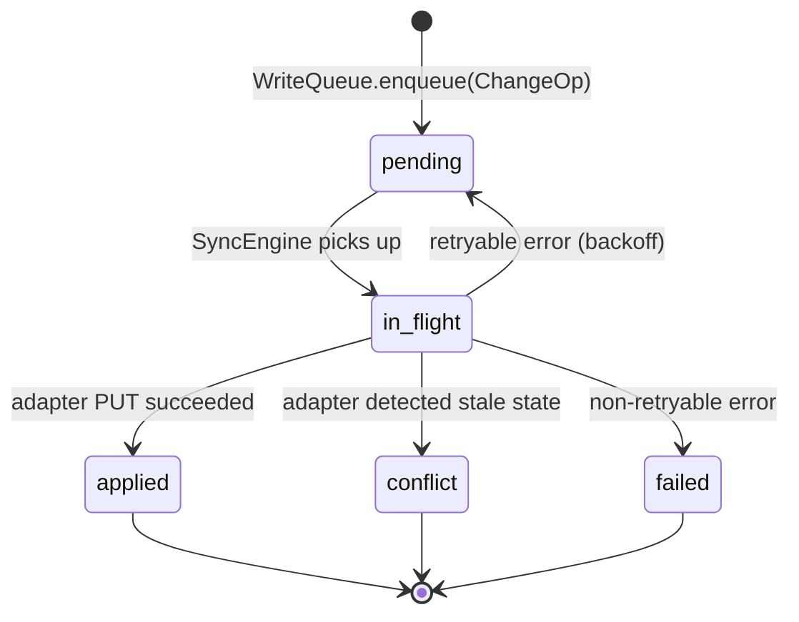
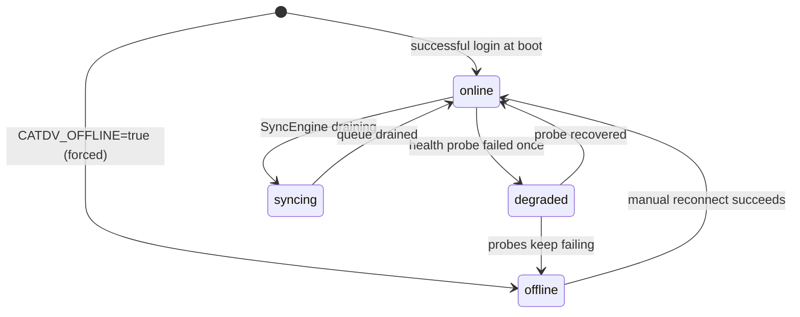
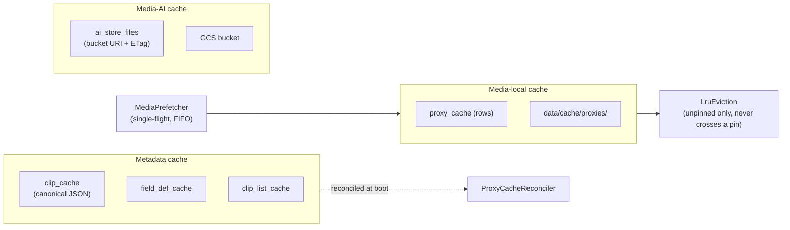

# 02 — Architecture

The app is a single FastAPI process serving HTML (Jinja + HTMX), plus
a handful of long-running background tasks. State is local: one SQLite
file plus a proxy cache directory. External I/O goes through two ports
— **ArchiveProvider** and **AIInputStore** — so the rest of the code
never talks to httpx, GCS, or the filesystem directly.

This page is the visual companion to
[`docs/ARCHITECTURE.md`](../ARCHITECTURE.md) and
[`docs/CONTEXT.md`](../CONTEXT.md). Read those when you need precise
definitions; come back here when you want the picture.

## Layer map

The four code layers and what each owns. **Layer rules are enforced by
`import-linter` on every commit** (see
[`06-coding-standards.md`](./06-coding-standards.md)).

### Layer rules (from `.importlinter`)

| Rule | Forbidden direction |
|---|---|
| Routes must not reach into archive adapter internals | `routes → archive.providers / .registry / .ai_stores / .provider / .ai_store / .ai_store_model / .change_set_json` |
| Services must not import routes | `services → routes` |
| Models stay pure | `models → services / repositories / routes` |

Routes **may** call services or repositories directly (current practice
in `routes/jobs.py` and `routes/live.py`) — that's a deliberate "looser"
contract from the architecture plan. What routes must not do is talk
to a specific adapter; they go through the port instead.

## AppContext — the composition root

Everything stateful is wired once at startup into a single `AppContext`
dataclass (`backend/app/context.py`) and stashed on `app.state.ctx`.
Routes pull it via the typed `get_ctx` dependency
([ADR 0020](../adr/0020-typed-get-ctx-accessor.md)).

The shutdown path is load-bearing: `aclose()` is what calls
`DELETE /catdv/api/9/session` and frees the seat. **Never SIGKILL the
process** — see [`05-catdv-license-discipline.md`](./05-catdv-license-discipline.md).

## End-to-end flow: annotate one clip

This is what happens when the operator clicks **Annotate ▾** on the
clip-detail page.

Accept/reject of `review_items` and pushing back to CatDV are the
follow-up step — they go through the **write queue**, below.

## Write queue (CatDV mutations)

Every accepted change becomes a `ChangeOp` row in `pending_operations`.
The `SyncEngine` background task drains them when `ConnectionMonitor`
says we're online.

- **Enqueue is atomic with mark_applied** — the locus of conflict
  detection is the adapter itself, not the queue
  ([ADR 0004](../adr/0004-pr4-enqueue-atomic-conflict-locus-adapter.md)).
- Per-row retry backoff is configurable
  (`SYNC_RETRY_BASE_S`, `SYNC_RETRY_MAX_S`).
- Sync is paused entirely while `ConnectionMonitor` state is not
  `online`.

## Connection state machine

The header pill in the UI reflects this state live (broadcast over the
`EventBus`). See
[ADR 0015](../adr/0015-offline-fallback-auto-degrade-manual-reconnect.md)
and [ADR 0017](../adr/0017-offline-mode-annotate-available-marker-nav-scope.md)
for the auto-degrade and offline-annotate-when-cached decisions.

## The three cache layers

The Cache Inspector (`services/cache_inspector.py`) is the single
read-side API across all three; the `/cache` UI page is its visualiser.

- **Pinning** lives in `workspace_clips` plus
  `clip_cache.pinned_to_workspace_id`. LRU eviction will never delete
  a pinned clip's bytes
  ([ADR 0006](../adr/0006-pr6-cache-layer-signals-audit-lru.md)).
- The **MediaPrefetcher** is intentionally single-threaded —
  parallelism is not a knob, because the slow VPN is the bottleneck
  ([ADR 0009](../adr/0009-pr8-media-prefetch-cache-ui-wiring.md)).
- Every cache mutation is audited to `cache_actions_log`.

## Where to dig deeper

| Question | Read |
|---|---|
| "What's a Workspace? What's a ClipKey?" | [`../CONTEXT.md`](../CONTEXT.md) |
| "Marker save returns 502 — where do I start?" | [`../ARCHITECTURE.md`](../ARCHITECTURE.md) symptom→file table |
| "Why is the schema shaped like this?" | The PR-N ADRs under [`../adr/`](../adr/) (0003–0007 cover the DB layout) |
| "How does the FS provider find proxies?" | [`../fs-archive-format.md`](../fs-archive-format.md) |
| "What did we learn writing Gemini Live?" | [`../gemini-live-lessons.md`](../gemini-live-lessons.md) |
