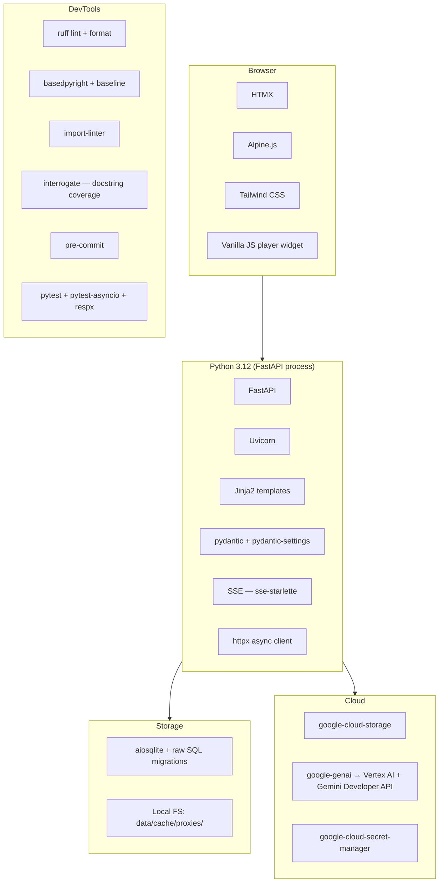

# 03 — Technology stack

Python-only top to bottom. The decision to skip a Node/React frontend
is [ADR 0001](../adr/0001-python-only-stack-no-node-frontend.md):
the UI is forms plus one video screen, React would be overkill, and
the single-maintainer cognitive surface is much smaller this way.

## At a glance

## Runtime dependencies (`pyproject.toml`)

| Package | Role |
|---|---|
| **fastapi** | HTTP framework; routers are organised under `backend/app/routes/`. |
| **uvicorn[standard]** | ASGI server; launched by `run.sh`. |
| **jinja2** | Server-rendered templates in `backend/app/templates/`. |
| **httpx** | Async client for the CatDV REST adapter (`archive/providers/catdv/`). |
| **aiosqlite** | Async SQLite driver — the only persistence layer. |
| **pydantic** | Domain models (`backend/app/models/`) and structured-output schemas for Gemini. |
| **pydantic-settings** | Reads `.env` into a typed `Settings` model (`backend/app/settings.py`). |
| **sse-starlette** | Server-Sent Events for live job/connection updates to the browser. |
| **google-genai** | Gemini SDK; talks to both Vertex AI (batch annotation) and the Developer API (Live audio). |
| **google-cloud-storage** | GCS uploads — the production `AIInputStore`. |
| **google-cloud-secret-manager** | Production secrets (CatDV creds) on the CatDV server. |
| **python-json-logger** | Structured logs. |
| **ftfy** | Fixes mojibake in CatDV's responses (the catalog has decades of mixed encodings). |
| **python-multipart** | Form parsing for HTMX POSTs. |

## Dev dependencies

| Package | Role |
|---|---|
| **pytest / pytest-asyncio / pytest-timeout** | Test runner; `asyncio_mode = "auto"` so async tests don't need a decorator. |
| **respx** | httpx mock for CatDV adapter tests. |
| **ruff** | Lint + format (replaces black + isort). Selected rules: `E F I B UP ASYNC` (with `ASYNC240` disabled — see [ADR 0019](../adr/0019-tier1-tooling-ruff-basedpyright-precommit.md)). |
| **basedpyright** | Type checker (`typeCheckingMode = "basic"`) with a baseline file at `.basedpyright/baseline.json` — only **new** type errors block a commit. |
| **import-linter** | Enforces the layer contracts in `.importlinter`. |
| **interrogate** | Docstring coverage gate (currently `fail-under = 30`, ratcheted upward over time). |
| **pre-commit** | Wires ruff, basedpyright, import-linter, and interrogate as a single pre-commit hook. |

## What runs in the browser

There is **no build step** for frontend code. Static assets in
`backend/app/static/` are served as-is; CSS is Tailwind's standalone CLI
output. The richest JS in the app is the vanilla-JS video player widget
(`backend/app/static/player.js`), used on the clip-detail page.

| Tech | Used for |
|---|---|
| **HTMX** | Most interactivity — POSTs return HTML fragments swapped into the DOM. |
| **Alpine.js** | Small bits of stateful interactivity (segmented controls, dropdowns). |
| **Tailwind CSS** | All styling, generated via the standalone CLI. |
| **Vanilla JS** | Player widget; Gemini Live WebSocket client (browser opens WSS straight to Google — see [ADR 0018](../adr/0018-gemini-live-clip-assistant-wss-view-model.md)). |

## External services

- **CatDV REST API** at `http://192.168.1.41:8080/catdv/api/9/...` (VPN
  in dev, loopback in prod).
- **Google Cloud Storage** — bucket holds the H.264 web proxies handed
  to Vertex.
- **Vertex AI** (`europe-west3`) — the production Gemini endpoint for
  batch annotation jobs.
- **Gemini Developer API**
  (`generativelanguage.googleapis.com`) — separate API key, used **only**
  by the optional Live clip assistant. See
  [ADR 0016](../adr/0016-gemini-live-clip-assistant-browser-direct.md).

## Python version

`>=3.12` is required (set in `pyproject.toml`). The codebase uses
PEP 604 union syntax (`int | None`), `Self` types, and `Path |
None` defaults in `pydantic-settings`, all of which need a recent
runtime.
