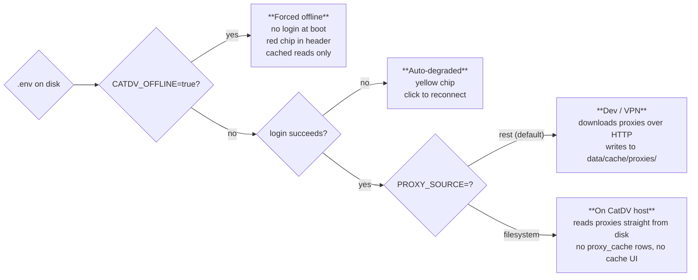

# 04 — Running locally

## Prerequisites

- **Python 3.12+** on `PATH` as `python3`.
- **VPN to the CatDV server** (`catdv-host.example`). Without it, the app
  either fails to start or auto-degrades to offline mode (see below).
- A **GCP service-account key** with permission to write to the project
  GCS bucket and call Vertex AI (path stored in
  `GOOGLE_APPLICATION_CREDENTIALS`). Per-dev minting steps below; the
  one-time project bootstrap is in `docs/DEPLOY.md` → "One-time GCP
  bootstrap".

## GCP service-account key

The app uploads proxies to GCS and calls Vertex AI as the shared
`catdv-annotator` service account. Each dev mints their own key JSON
from that SA — the bucket and project already exist (created once by the
one-time GCP bootstrap in `docs/DEPLOY.md`).

```bash
# 1. Authenticate gcloud (browser flow) and pick the project
gcloud auth login
gcloud config set project <project-id>     # e.g. your-gcp-project

# 2. Mint a key for the shared SA
mkdir -p ~/.gcp
gcloud iam service-accounts keys create ~/.gcp/catdv-annotator-key.json \
  --iam-account=catdv-annotator@<project-id>.iam.gserviceaccount.com

# 3. Point the app at it
echo 'GOOGLE_APPLICATION_CREDENTIALS=/Users/<you>/.gcp/catdv-annotator-key.json' >> .env
```

Notes:

- The SA email pattern is fixed by the bootstrap:
  `catdv-annotator@<project-id>.iam.gserviceaccount.com`.
- Keys are **sensitive**. Keep them outside the repo (`~/.gcp/` is a
  fine convention), `chmod 600`, never commit, never paste into chat.
- GCP enforces a hard cap of **10 active keys per service account**.
  List with `gcloud iam service-accounts keys list --iam-account=<sa>`
  and delete old ones with
  `gcloud iam service-accounts keys delete <key-id> --iam-account=<sa>`.
- If the project / bucket / SA don't exist yet, run the one-time GCP
  bootstrap in `docs/DEPLOY.md` first — that's the one-time setup, not a
  per-dev step.

## First run

```bash
git clone <repo>
cd catdv-annotator
cp .env.example .env
# Edit .env — at minimum CATDV_PASSWORD and GOOGLE_APPLICATION_CREDENTIALS
./run.sh
```

`run.sh` is idempotent: creates `.venv` if missing, installs the package
in editable mode with the `[dev]` extras, exports `.env` into the
process environment, then `exec`s `uvicorn backend.app.main:app`.

Set `DEV_RELOAD=1 ./run.sh` to enable `--reload --reload-dir backend`.

### Manual venv setup (no server launch)

If you just want the environment ready — to run tests, scripts, or
poke around in a REPL — without starting uvicorn and taking a CatDV
seat:

```bash
python3 -m venv .venv
.venv/bin/pip install --upgrade pip
.venv/bin/pip install -e ".[dev]"
```

This is exactly the first three steps of `run.sh` minus the `.env`
export and the `exec uvicorn`. After this you can:

```bash
.venv/bin/pytest -q                       # run tests
.venv/bin/python -m backend.app.<module>  # one-off scripts
.venv/bin/python                          # REPL with deps available
```

Re-run `pip install -e ".[dev]"` after a `pyproject.toml` change to
pick up new dependencies; otherwise the venv is reusable across
sessions.

### Smoke test

```bash
curl -s http://localhost:8765/api/health
open  http://localhost:8765/          # clip list
open  http://localhost:8765/cache     # cache inspector / actions
```

> ⚠️ **Before launching, check no other instance is running.** Two
> uvicorn processes against CatDV will exhaust your one available
> license seat. See
> [`05-catdv-license-discipline.md`](./05-catdv-license-discipline.md).

## The four runtime modes

The same code base serves four operating modes, selected via env vars.



### 1. Default — VPN dev mode (`PROXY_SOURCE=rest`)

What you'll use 90% of the time on your laptop.

- Logs in to CatDV at boot, takes a license seat.
- Downloads each clip's H.264 web proxy on demand to
  `data/cache/proxies/`, indexed in the `proxy_cache` table.
- The `/cache` UI shows the local cache; LRU eviction runs periodically.

### 2. Filesystem mode (`PROXY_SOURCE=filesystem`)

Used when the annotator is deployed **on the CatDV server itself**. The
hires→proxy mapping is fetched from
`GET /catdv/api/9/mediastores` at startup, and each clip's proxy is
read directly from `/Volumes/ARECA/CatDV_Proxy/...` (or the matching
volume).

- No `data/cache/proxies/` writes.
- No `proxy_cache` rows.
- The Cache filter dropdown, "Cache locally" actions, and per-clip
  Evict buttons are **hidden automatically** in this mode.
- Hard requirement: the OS user must have read access to every
  directory listed under `mediaType: proxy, target: web` in
  `/catdv/api/9/mediastores`. Missing access raises `ProxyNotFound`
  loudly — no automatic fallback to REST (intentional, see
  [ADR 0014](../adr/0014-local-filesystem-proxy-resolution.md)).

### 3. Forced offline (`CATDV_OFFLINE=true`)

When the VPN is unavailable or you just want to develop without taking
a seat.

- No CatDV login at boot (and crucially, **no seat taken**).
- Clip list + clip details served from the local SQLite cache.
- Proxies served only if already cached to `data/cache/proxies/`.
- Annotate stays available iff the proxy is locally cached
  ([ADR 0017](../adr/0017-offline-mode-annotate-available-marker-nav-scope.md)).
- Header shows red "Offline (forced)" chip.
- Any writes (markers, fields) are queued and flushed when the app is
  next started without the flag.

### 4. Auto-degraded (no env flag)

If `CATDV_OFFLINE` is unset but the initial login fails — or a periodic
health probe fails mid-session — the app **degrades to offline
automatically**. The header chip turns yellow and offers a manual
reconnect. See
[ADR 0015](../adr/0015-offline-fallback-auto-degrade-manual-reconnect.md).

## Optional: Gemini Live clip assistant

A voice-driven Czech assistant on the clip-detail page. Browser opens a
WebSocket straight to Google Live; audio bytes never traverse our
process.

```bash
# One-shot setup — mints the Gemini Developer API key
GCP_PROJECT_ID=<your-project> ./deploy/enable-gemini-live.sh

# The script prints the key — paste it into .env
echo 'GEMINI_API_KEY=<printed-key>' >> .env

# Restart
./run.sh
```

The `🎤 Live` button only appears on clips with `duration_secs > 0` and
only when the app is in **`online`** mode. With `GEMINI_API_KEY`
unset, the feature stays silent.

## Tests

```bash
.venv/bin/pytest -q
```

Async tests use `asyncio_mode = "auto"`, so they don't need a
decorator. The CatDV adapter uses `respx` for httpx mocking.

### End-to-end walkthrough tests

`tests/walkthrough/` drives the **real app** through Playwright in its
own in-process instance on port `8766` — **fully offline, no CatDV
seat** (see `05-catdv-license-discipline.md`). Each scenario doubles as
an annotated walkthrough video.

```bash
.venv/bin/python -m tests.walkthrough.run --assert      # headless pass/fail
.venv/bin/python -m tests.walkthrough.run --record      # annotated videos + gallery
```

The assert-mode run is also a pytest test and self-skips when Chromium
or ffmpeg are absent. One-time setup:

```bash
.venv/bin/pip install -e ".[dev]" && .venv/bin/playwright install chromium
# ffmpeg: brew install ffmpeg
```

Full reference — architecture, how to add a scenario, and the rule to
keep scenarios in sync with UI changes — is in
[`tests/walkthrough/README.md`](../../tests/walkthrough/README.md). The
`/e2e` skill is the day-to-day entry point.

## Key env vars (quick reference)

The complete list is in [`.env.example`](../../.env.example). The ones
you'll touch most:

| Var | What |
|---|---|
| `BIND_PORT=8765` | Server port. |
| `DATA_DIR=./data` | Where `app.db` and `cache/proxies/` live. |
| `CATDV_BASE_URL` | `http://catdv-host.example:8080` in dev; `http://localhost:8080` in prod. |
| `CATDV_USERNAME` / `CATDV_PASSWORD` | App identity. In prod, password comes from Secret Manager — do not set in `.env`. |
| `CATDV_CATALOG_ID=881507` | The one catalog the app reads/writes. |
| `PROXY_SOURCE` | `rest` (default) or `filesystem` (on CatDV host). |
| `CATDV_OFFLINE` | `true` to skip login entirely. |
| `PROXY_CACHE_CAP_GB=20` | Hard cap for the proxy cache directory. |
| `MEDIA_CACHE_CAP_GB=50` | LRU eviction threshold for unpinned clips. |
| `GCP_PROJECT_ID` / `GCS_BUCKET_NAME` / `GOOGLE_APPLICATION_CREDENTIALS` | Vertex + GCS plumbing. |
| `GEMINI_MODEL` | Default `gemini-2.5-pro`. |
| `GEMINI_API_KEY` | Live assistant only — leave blank to disable. |
| `APP_ENV` | `dev` or `prod`; in `dev` the external clients are bypassed when their creds are blank. |
| `DEV_RELOAD=1` | Pass through to uvicorn's `--reload`. |

## Stopping the server

**Always use `SIGTERM`. Never `SIGKILL`.** See the next chapter — this
is the single thing most likely to bite you in your first week.
