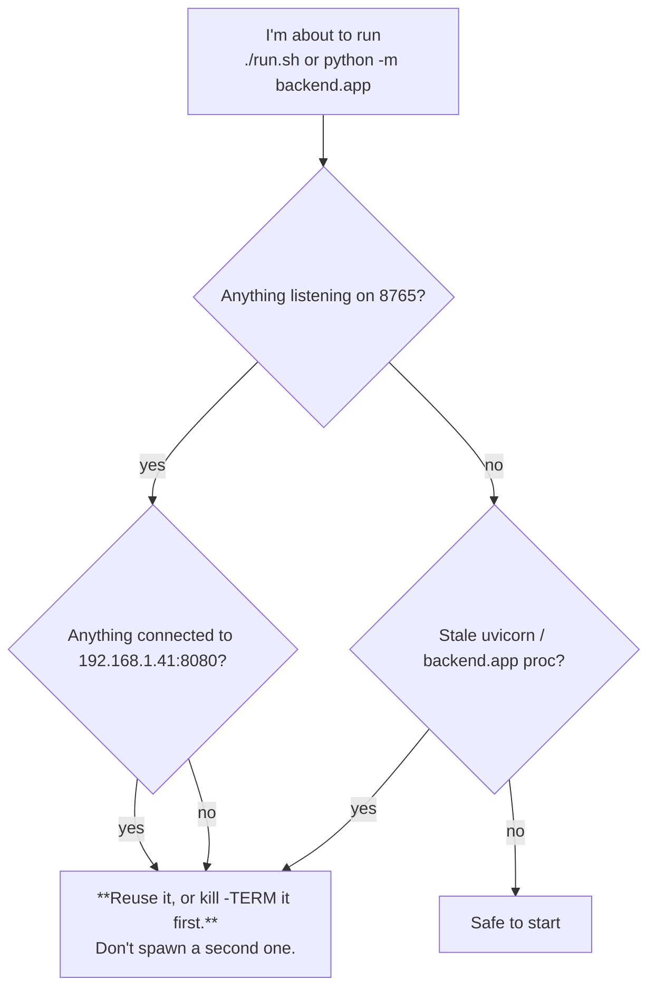
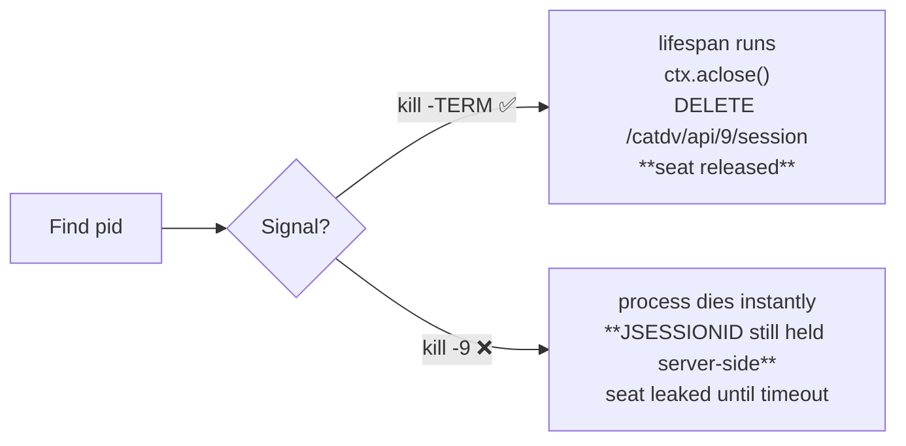
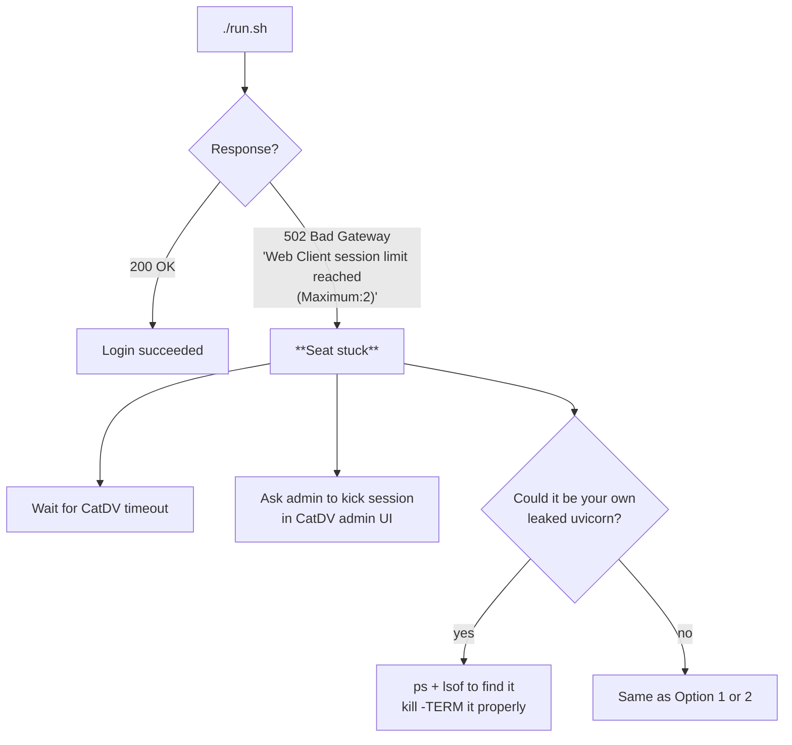

# 05 — CatDV license discipline (read this before launching anything)

## The constraint, in one paragraph

CatDV Enterprise has a **2-seat session limit**. One seat is almost
always taken by the human web client. **Assume your app has exactly 1
seat.** A leaked `JSESSIONID` locks the server out until CatDV's
server-side idle timeout drops it — which can take many minutes, during
which nobody (you, the human, scripts) can log in. This isn't a
theoretical risk; it has bitten this project repeatedly.

This page is the operational distillation of the rules in
[`../../CLAUDE.md`](../../CLAUDE.md). When in doubt, that file is the
source of truth.

## The two rules

### Rule 1 — Check before starting



The exact commands:

```bash
/usr/sbin/lsof -nP -iTCP:8765 -sTCP:LISTEN
/bin/ps -ef | /usr/bin/grep -E '(uvicorn|backend\.app)' | /usr/bin/grep -v grep
/usr/sbin/lsof -nP -iTCP@192.168.1.41:8080
```

### Rule 2 — Always shut down gracefully



After kill, **confirm in the server log**:

```
INFO:     Shutting down
INFO:     Waiting for application shutdown.
INFO:     Application shutdown complete.   ← this means the seat was released
INFO:     Finished server process [...]
```

If you only see `Finished server process` without the three lines above,
the seat may still be held. Wait it out or ask the CatDV admin to kick
the stale session.

## One-shot scripts must log out too

If you `POST /session` directly from a script or `curl`, **you've taken
a seat**. You must finish with:

```bash
curl -b /tmp/jar -X DELETE http://192.168.1.41:8080/catdv/api/9/session
```

Otherwise the seat stays held for the JSESSIONID's idle-timeout window.

## Reading the symptoms



**Do not just keep retrying.** Retrying doesn't free anything.

## Why this happens (one paragraph)

The CatDV REST API binds the session to `JSESSIONID` and the seat is
held **server-side**, not by our process. So even when our process
dies, the seat can linger. Two halves matter:

1. **Don't spawn redundant logins.** Check before starting.
2. **Always release.** The only thing that releases the seat is
   `DELETE /catdv/api/9/session`, which `AppContext.aclose()` calls
   from the FastAPI `lifespan` exit. That code only runs on
   `SIGTERM` / clean exit. `SIGKILL` skips it.

That combination — check first, exit gracefully — is what keeps the
one available seat usable for the next dev session.

## Quick reference card

| Situation | Do this |
|---|---|
| About to start the dev server | Run the three check commands above. |
| Need to restart | `kill -TERM <pid>`, watch for "Application shutdown complete", **then** start. |
| Hit 502 "Maximum:2" | Find your own zombie first (`ps`, `lsof`). If none, wait or ask the admin. |
| Wrote a one-shot curl/script | End with `DELETE /catdv/api/9/session`. |
| About to `kill -9` | **Stop.** Use `-TERM`. If it won't die in 30s, then escalate. |
| Working without VPN | Use `CATDV_OFFLINE=true` — no seat taken at all. |
