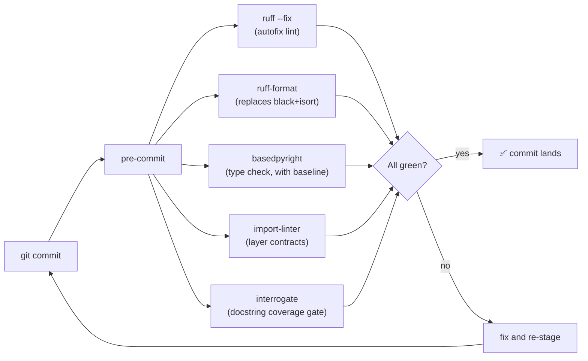

# 06 — Coding standards and enforcement

The architecture was always fine; what was missing was *enforcement*.
The Tier-1 tooling ADR
([0019](../adr/0019-tier1-tooling-ruff-basedpyright-precommit.md))
spells out the rollout. This page is the user manual.

## What runs on every commit



Hooks are wired in `.pre-commit-config.yaml`. To install them locally:

```bash
.venv/bin/pre-commit install
```

To run them all without committing:

```bash
.venv/bin/pre-commit run --all-files
```

## Tool by tool

### 1. ruff (lint + format)

Configured in `pyproject.toml`:

```toml
[tool.ruff]
line-length = 100
target-version = "py312"

[tool.ruff.lint]
select = ["E", "F", "I", "B", "UP", "ASYNC"]
ignore = ["ASYNC240"]                       # see ADR 0019

[tool.ruff.lint.per-file-ignores]
"tests/**/*.py" = ["B017"]                  # pytest.raises(Exception) is intentional
```

`ruff format` replaces black + isort. `ASYNC240` is disabled
deliberately — see [ADR 0019](../adr/0019-tier1-tooling-ruff-basedpyright-precommit.md)
for the reasoning. The one legitimately blocking call
(`_stream_to_file`) is wrapped in `asyncio.to_thread` per chunk and
carries its own targeted `# noqa: ASYNC230`.

Pin: `ruff-pre-commit` is at `v0.15.13`. Don't drift; version mismatch
causes `Unknown rule selector` errors.

### 2. basedpyright (type checker, with baseline)

```toml
[tool.basedpyright]
include = ["backend", "tests"]
pythonVersion = "3.12"
typeCheckingMode = "basic"
reportMissingImports = "error"
reportMissingTypeStubs = "none"
```

The baseline at `.basedpyright/baseline.json` snapshots ~237
pre-existing errors. The pre-commit hook only fails on **new** errors.
Refresh the baseline (only after deliberately reducing the count):

```bash
.venv/bin/basedpyright --writebaseline backend/ tests/
```

The ratchet is to keep promoting individual rules to `error` as
specific areas get clean. Don't try to fix the baseline all at once.

### 3. import-linter (layer contracts)

Configured in `.importlinter`. Three contracts, all `type = forbidden`:

| Contract | What's forbidden |
|---|---|
| `no-routes-into-archive-adapters` | `routes` → `archive.providers / .registry / .ai_stores / .provider / .ai_store / .ai_store_model / .change_set_json` |
| `no-services-importing-routes` | `services` → `routes` |
| `no-models-importing-anything` | `models` → `services / repositories / routes` |

Routes **may** call services or repositories directly (deliberate
"looser" contract — see the `.importlinter` header comment). What they
must not do is reach into adapter internals. They go through the port
(`ArchiveProvider`, `AIInputStore`) instead.

Run locally:

```bash
.venv/bin/lint-imports
```

### 4. interrogate (docstring coverage)

Currently `fail-under = 30`. Every module needs a top-of-file docstring
(that part is done). Per-callable docstring coverage is the next
ratchet.

```toml
[tool.interrogate]
ignore-init-method = true
ignore-init-module = true
ignore-magic = true
ignore-private = true
ignore-property-decorators = true
ignore-module = false
fail-under = 30
exclude = ["tests", "backend/migrations"]
```

### 5. pytest (tests)

```toml
[tool.pytest.ini_options]
asyncio_mode = "auto"
testpaths = ["tests"]
```

Async tests don't need a decorator. Test layout mirrors the source
tree under `tests/`. CatDV HTTP is mocked with `respx`.

```bash
.venv/bin/pytest -q
```

## Code style conventions you'll see

- **No `if TYPE_CHECKING` cycles unless necessary** — `AppContext` uses
  it because it imports services that import the context type back.
- **`from __future__ import annotations`** is preferred at the top of
  modules to keep forward references cheap.
- **PEP 604 unions** (`int | None`) over `Optional[int]` — basedpyright
  in `basic` mode is fine with both, but the codebase has consistently
  picked the newer form.
- **Module-level docstrings** are required by `interrogate` (and they
  matter: the symptom→file triage table in `ARCHITECTURE.md` works
  because every module has a one-line "what this owns" docstring).
- **Repos are stateless** — `PromptsRepo()`, `ClipCacheRepo()` etc. take
  no args; the DB connection is passed at call time. Construct once in
  `AppContext.build()`.
- **Services hold no per-request state.** Everything per-request lives
  on the FastAPI `Request`; per-process state lives on `AppContext`.

## Architecture decisions (ADRs)

When you make a non-trivial design call, **add an ADR before the
session ends.** From `CLAUDE.md`:

> The bar is "would a future contributor reading the diff ask *why*?"
> If yes, document it. If the call was forced by an obvious constraint
> and the diff itself makes the reasoning self-evident, skip it.

How:

1. Pick the next number after the highest in
   [`../adr/`](../adr/) (currently 0022).
2. Create `docs/adr/NNNN-slug.md` using MADR-lite format:
   ```markdown
   # NNNN. Title

   - **Date:** YYYY-MM-DD
   - **Status:** Accepted | Proposed | Superseded by NNNN

   ## Context
   …
   ## Alternatives
   …
   ## Decision
   …
   ## Consequences
   …
   ```
3. Add the entry to the table in
   [`../decisions.md`](../decisions.md).
4. Group related calls into one ADR when they share context — see the
   `PR 3` / `PR 5` / `PR 6` / `PR 7` ADRs for the pattern.

Pure mechanical work (renames, dependency bumps, test additions) does
**not** need an ADR.

## Common mistakes to avoid

| Don't | Do |
|---|---|
| Reach into `backend.app.archive.providers.catdv.adapter` from a route. | Add a method to `ArchiveProvider` or a service, then call that. |
| Hand-write a SQL query inside a service. | Add it to the matching `repositories/<table>.py`. |
| `kill -9` the dev server when it's slow to stop. | `kill -TERM` and wait. See [`05-catdv-license-discipline.md`](./05-catdv-license-discipline.md). |
| Add a per-request cache to a service. | Services are singletons; put it on `AppContext` or in a repo with a TTL. |
| Skip pre-commit with `--no-verify`. | Fix the hook output. If it's wrong, change the config and ADR the decision. |
| Bypass the write queue to "just PUT this one marker". | Enqueue a `ChangeOp`; the sync engine owns all CatDV writes. |
