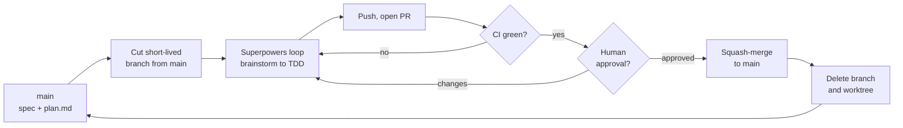
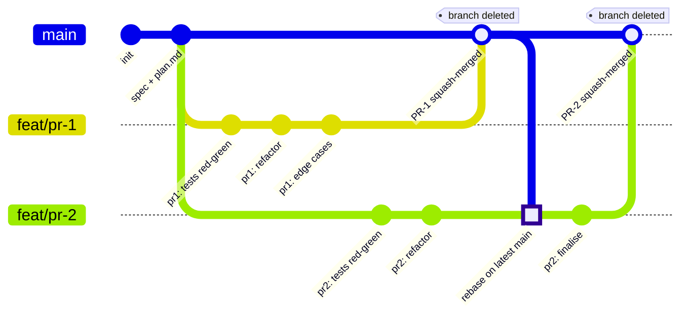

# Development workflow — Claude Code + Superpowers

This is our standard process for AI-assisted development. AI-assisted work
produces large diffs quickly. Without a shared workflow that turns into merge
conflicts, unreviewed code, and lost design intent. Follow this for all
implementation work.

## Lifecycle at a glance

The full path of a single PR. A CI failure or a review change request loops
back into the Superpowers loop; a clean pass squash-merges to `main` and the
branch is deleted.

## Branching model: trunk-based

- `main` is the single source of truth and is always releasable: it builds and
  the app runs.
- All work happens on **short-lived branches cut from `main`**. Target lifetime
  1–2 days. If a branch lives longer, the unit of work was too big — split it.
- **No long-lived integration or epic branches.** No `develop`. A `spec+plan`
  branch with implementation branches hanging off it is an epic branch in
  disguise — it defers all integration to one merge and re-creates big-bang
  integration. Don't.
- `main` is protected: no direct pushes. Merge only via PR with green CI and at
  least one human approval.
- Branch naming: `feat/<ticket>-<short-desc>`, `fix/<ticket>-<short-desc>`,
  `chore/<short-desc>`.

## Specs and plans live on `main`

- A multi-PR feature starts with a spec and `plan.md` committed to `main` as
  **its own small PR**.
- That PR gets a human review. **This review is the spec sign-off gate** —
  implementation does not start until it merges. Catching a wrong spec here is
  cheap; catching it at the final implementation PR is not.
- `plan.md` contains a checklist. Each implementation PR ticks its own boxes.
  The copy on `main` is the live, visible progress ledger.
- A planning document is inert — it ships nothing and breaks nothing. Committing
  an in-progress spec to `main` does not violate "always releasable".
- If the spec changes mid-build, that is its own small reviewed PR. Design
  changes stay loud and visible in history.

## The per-task loop (Superpowers)

For each implementation branch:

1. **Brainstorm** — refine intent into a validated mini-spec scoped to this PR.
2. **Worktree** — `git worktree add` an isolated workspace on a fresh branch cut
   from the latest `main`.
3. **Plan** — confirm the slice of `plan.md` this PR delivers.
4. **Build** — TDD, tests first. Granular commits per micro-task; these get
   squashed at merge.
5. **Self-review** — fresh-agent review pass. This is pre-PR hygiene, **not** a
   substitute for human review.
6. **Finish** — push, open PR.

Worktrees are per-machine. One developer may run several loops in parallel
worktrees; this is invisible to the rest of the team. A worktree maps to one
branch — it is not a shared concept.

## Working in parallel (two or more developers)

- Each developer cuts their branch from the current `main`.
- Design the PR breakdown so parallel branches are **independent by default** —
  no shared state, mergeable in any order.
- Before merging, rebase onto the latest `main`: `git fetch && git rebase
  origin/main`. Whoever merges second integrates first.
- Resolve conflicts on your branch, re-run tests, then merge. **Never merge a
  branch that has not been rebased onto the current `main`.**

Both branches are cut from the same spec commit and develop in parallel. Each
branch's granular TDD commits collapse into a single squash-merge commit on
`main`, after which the branch is deleted. `feat/pr-2` merges second, so it
rebases onto the latest `main` — picking up PR-1 — before its own merge.

## Dependent work: stacked PRs

When PR-2 genuinely depends on PR-1, do not create an epic branch. Either:

- **Serial** — finish PR-1, merge to `main`, then cut PR-2 from updated `main`.
  Simple and safe; you pay the wall-clock wait.
- **Stacked** — cut PR-2 from PR-1's branch and open it targeting PR-1's branch.
  When PR-1 merges to `main`, retarget PR-2 to `main` and restack
  (`git rebase --update-refs`, or a stacking tool).

Either way, each PR still merges into `main` individually and in order. The
stack is a development and review convenience — not an integration branch.

## Incomplete work: feature flags

Code that lands before it is user-visible goes behind a feature flag. This
decouples "merged" from "released" and is what makes a multi-PR feature safe to
develop on trunk.

## Merging

- **Squash-merge every PR.** A branch carries many granular TDD commits; `main`
  gets one commit per PR.
- The squash commit message: a clear summary plus a reference to the ticket and
  the `plan.md` step.
- **Delete the branch immediately after merge.** Remove the worktree
  (`git worktree remove`).
- The next task starts from a fresh worktree off the updated `main`.

## CI

- CI runs the full test suite on every PR, against the **merge result** — not
  just the branch tip.
- Green CI is a required merge gate. A local "tests pass" or a Superpowers clean
  baseline is a local claim. CI is the team's source of truth.

## Code review

- The reviewer reads the spec / `plan.md` **first**, then reviews the diff
  against stated intent. Review the intent, not just the lines.
- AI self-review covers mechanical issues — dead code, missed edge cases, test
  gaps. Humans own architecture, security, and "is this the right thing".
- One human approval minimum. Do not rubber-stamp: when AI multiplies output,
  human review becomes the real bottleneck.
- If parallel worktrees flood the review queue, apply a WIP limit on open PRs
  per author.

## Commit attribution

- AI-assisted commits carry a `Co-authored-by:` trailer (or the team's agreed
  marker).
- "Who or what produced this change" must be queryable from history — this
  matters for audit (DORA / NIS2).

## Per-PR checklist

**Before opening the PR**

- [ ] Branch cut from the current `main`
- [ ] Scoped to one slice of `plan.md`
- [ ] Tests written and passing locally
- [ ] Fresh-agent self-review done
- [ ] Rebased onto the latest `origin/main`

**Before merging**

- [ ] Green CI
- [ ] One human approval
- [ ] `plan.md` checkboxes updated
- [ ] Feature flag in place if the work is not yet user-ready

**After merging**

- [ ] Squash-merged
- [ ] Branch deleted
- [ ] Worktree removed
